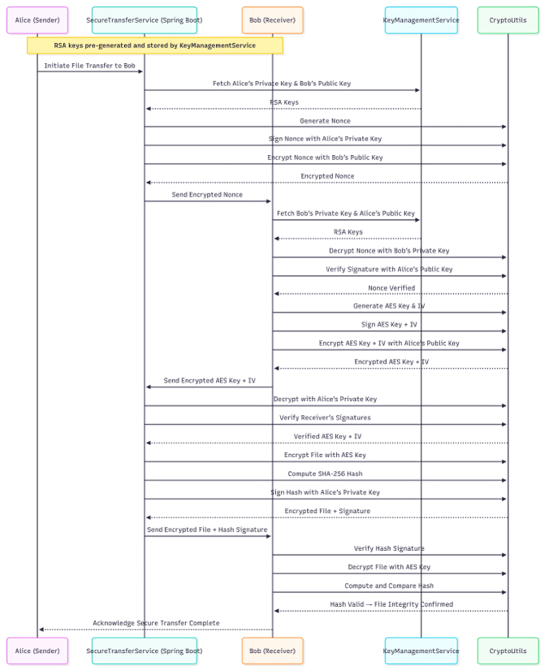
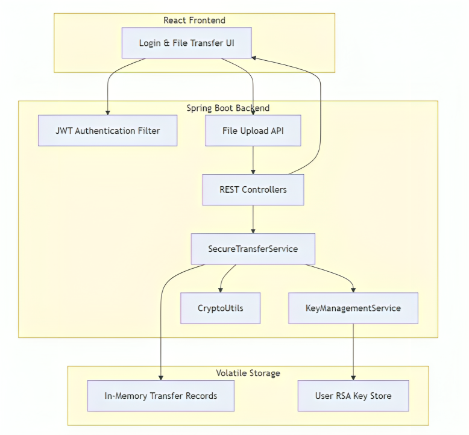
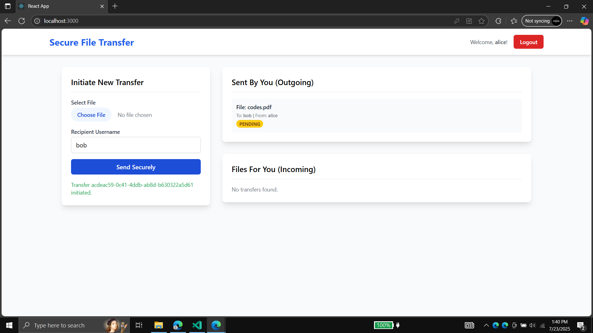
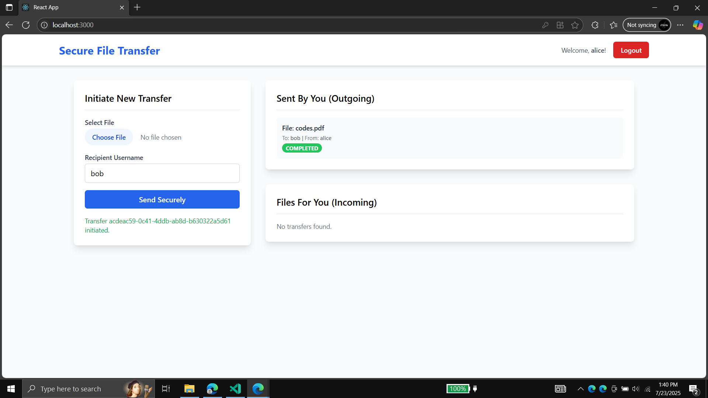
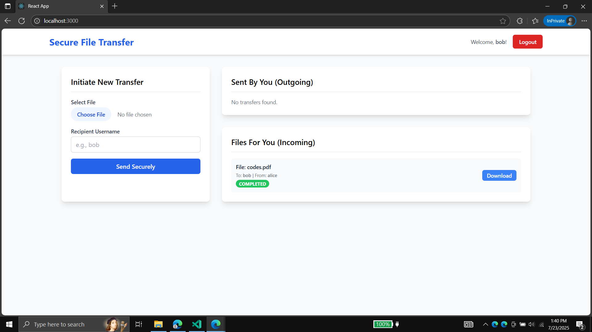

# Secure File Transfer Protocol

[](https://opensource.org/licenses/MIT)
[](https://www.oracle.com/java/)
[](https://spring.io/projects/spring-boot)
[](https://reactjs.org/)
[](https://tailwindcss.com/)

A custom Secure File Transfer Protocol implemented in a client-server architecture using Java Spring Boot and React. This project demonstrates the application of cryptographic principles (RSA and AES) to ensure the confidentiality, integrity, and authenticity of files in transit.

## Overview

Transferring files over a network exposes data to risks like eavesdropping and tampering. This project counters these risks by implementing a custom Secure File Transfer Protocol that incorporates strong encryption and authentication methods. The protocol is built on a Java-based backend and a React/Tailwind frontend.

Users authenticate via JWT tokens to use the system. Once authenticated, a sender can securely transfer a file to a receiver through a series of cryptographic exchanges that establish trust and protect the file data.

## Key Features

*   **Confidentiality:** File contents are encrypted using AES-256, a strong symmetric cipher, to prevent eavesdropping.
*   **Integrity:** A SHA-256 hash of the file is generated and digitally signed. This guarantees that the file content has not been altered or corrupted during transfer.
*   **Authenticity:** Mutual authentication is achieved using an RSA-based handshake, ensuring the sender and receiver are who they claim to be.
*   **End-to-End Security:** The protocol combines asymmetric (RSA-2048) and symmetric (AES-256) cryptography to leverage the strengths of each, providing robust end-to-end security.
*   **Modern Tech Stack:** Built with a Spring Boot backend for robust business logic and a React frontend for a responsive user experience.

## Protocol Design

The protocol operates in three main phases, combining public-key and symmetric-key cryptography to ensure a secure exchange.

1.  **Handshake (Mutual Authentication)**
    *   The sender generates a random nonce (a unique, single-use number).
    *   The nonce is signed with the sender's RSA private key and then encrypted with the receiver's RSA public key.
    *   The receiver decrypts the message with their private key and verifies the nonce's signature with the sender's public key.
    *   This authenticates the sender to the receiver. A failure at this stage aborts the transfer.

2.  **Session Key Exchange (Symmetric Key Setup)**
    *   After a successful handshake, the receiver generates a fresh random AES-256 session key and an Initialization Vector (IV).
    *   The receiver encrypts the AES key and IV with the sender's RSA public key and signs them with their own RSA private key.
    *   The sender decrypts the session key and IV with their private key and verifies the signatures with the receiver's public key.
    *   This authenticates the receiver to the sender and securely establishes a shared secret key (the AES key) for bulk file encryption.

3.  **Secure File Transfer (Confidentiality & Integrity)**
    *   The sender computes a SHA-256 hash of the file and signs the hash with their RSA private key.
    *   The sender encrypts the file content using the shared AES session key.
    *   The encrypted file and the signed hash are sent to the receiver.
    *   The receiver first verifies the signature on the hash using the sender's public key.
    *   If the signature is valid, the receiver decrypts the file using the shared AES key.
    *   Finally, the receiver computes a new SHA-256 hash of the decrypted file and compares it to the original hash received from the sender. If they match, the transfer is successful.

### Protocol Sequence Diagram

The following diagram illustrates the complete sequence of operations between the sender, receiver, and backend services.

<p align="center">
  
  <br>
  <em>Figure 2.1: Sequence diagram showing handshake, key exchange, and encrypted file delivery.</em>
</p>


## System Architecture

The application is composed of a Spring Boot backend and a React frontend.

*   **React Frontend:** Provides the user interface for login, selecting a recipient, and uploading a file for transfer. It communicates with the backend via a RESTful API over HTTPS.
*   **Spring Boot Backend:** Contains the core protocol logic.
    *   **`REST Controllers`:** Expose API endpoints for authentication (`/api/auth`) and file transfer (`/api/transfers`).
    *   **`JWT Authentication Filter`:** Secures the API endpoints, ensuring only authenticated users can perform transfers.
    *   **`SecureTransferService`:** Orchestrates the entire protocol, from the initial handshake to the final integrity check.
    *   **`KeyManagementService`:** Manages user RSA key pairs. For this demo, keys for "Alice" and "Bob" are generated and stored in-memory.
    *   **`CryptoUtils`:** A utility class that handles all cryptographic operations: hashing (SHA-256), RSA and AES encryption/decryption, and digital signatures.

<p align="center">
  
  <br>
  <em>Figure 3.1: Component-level architecture of the secure file transfer system.</em>
</p>


## Technology Stack

*   **Backend:**
    *   Java 17
    *   Spring Boot 3
    *   Spring Security (for JWT authentication)
*   **Frontend:**
    *   React 18
    *   Tailwind CSS
    *   Axios (for API requests)
*   **Cryptography:**
    *   Java Cryptography Architecture (JCA)
    *   **Asymmetric:** RSA/ECB/PKCS1Padding (2048-bit)
    *   **Symmetric:** AES/CBC/PKCS5Padding (256-bit)
    *   **Hashing:** SHA-256
    *   **Signatures:** SHA256withRSA

## Getting Started

### Prerequisites

*   Java JDK 17 or later
*   Maven 3.x
*   Node.js 18.x or later
*   npm

### Installation & Setup

1.  **Clone the repository:**
    ```bash
    git clone https://github.com/PasanAbeysekara/secure-file-transfer-protocol.git
    cd secure-file-transfer-protocol
    ```

2.  **Run the Backend (Spring Boot):**
    *   Navigate to the `backend` directory.
      ```bash
      cd backend
      ```
    *   Run the application using Maven.
      ```bash
      mvn spring-boot:run
      ```
    *   The backend server will start on `http://localhost:8080`. The server initializes two users, `alice` and `bob`, with pre-configured RSA key pairs.

3.  **Run the Frontend (React):**
    *   Open a new terminal and navigate to the `frontend` directory.
      ```bash
      cd frontend
      ```
    *   Install the required npm packages.
      ```bash
      npm install
      ```
    *   Start the React development server.
      ```bash
      npm start
      ```
    *   The frontend application will be available at `http://localhost:3000`.

## User Interface & Usage

1.  **Login:**
    *   Open your browser to `http://localhost:3000`.
    *   You can log in as one of the two pre-configured users. Use username `alice` or `bob` with the password `password`.

2.  **Initiate a Transfer (as Alice):**
    *   Log in as `alice`.
    *   In the "Initiate New Transfer" section, select a file to upload and enter `bob` as the recipient.
    *   The transfer will appear in the "Sent By You (Outgoing)" list with a "PENDING" status.

    <p align="center">
      
      <br>
      <em>Figure 4.2: Alice initiates a secure file transfer to Bob.</em>
    </p>


3.  **Confirm Transfer Completion (Alice's View):**
    *   Upon successful completion of the protocol, the status will update to "COMPLETED".

    <p align="center">
      
      <br>
      <em>Figure 4.3: The transfer status is updated to "Completed" in Alice's dashboard.</em>
    </p>


5.  **Receive a Transfer (as Bob):**
    *   Log in as `bob`.
    *   The incoming file from `alice` will appear in the "Files For You (Incoming)" list.
    *   Click the "Download" button to save the file.

    
    *Figure 4.4: Bob views the completed incoming transfer from Alice.*
    <p align="center">
      
      <br>
      <em>Figure 4.4: Bob views the completed incoming transfer from Alice.</em>
    </p>


## Security Considerations

*   **Man-in-the-Middle (MITM) Attacks:** Mitigated by using digital signatures for authentication and a unique nonce for preventing replay attacks. In a production system, a proper Public Key Infrastructure (PKI) would be necessary.
*   **Padding:** The implementation uses PKCS#1 v1.5 padding. For enhanced robustness, future work could integrate RSA-OAEP for encryption and RSA-PSS for signatures.

## Future Improvements

*   **Scalable Key Management:** Implement dynamic key generation for new users.
*   **PKI Integration:** Integrate a certificate-based PKI to support real-world trust validation.
*   **Large File Support:** Enhance support for larger files through streaming data encryption.

## Authors

This project was developed as part of the EC7201 - Information Security course at the Department of Computer Engineering, Faculty of Engineering, University of Ruhuna.

*   **Abeysekara P.K.** (EG/2020/3799)
*   **Lelwala L.G.S.R.** (EG/2020/4047)
*   **Malisha A.P.D.** (EG/2020/4065)

## License

This project is licensed under the MIT License. See the [LICENSE](LICENSE) file for details.
